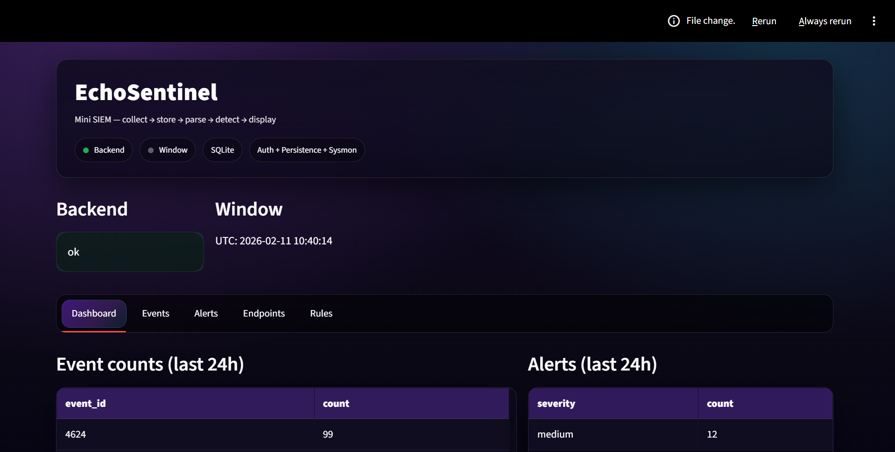
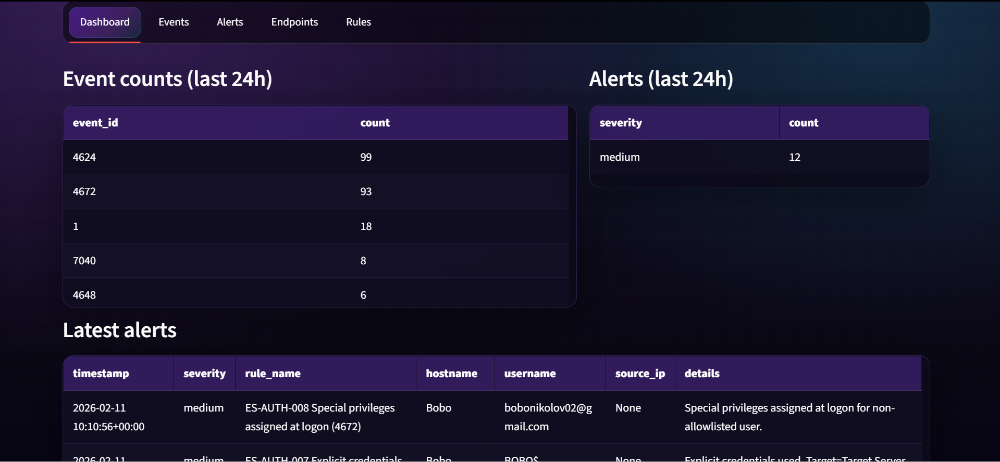
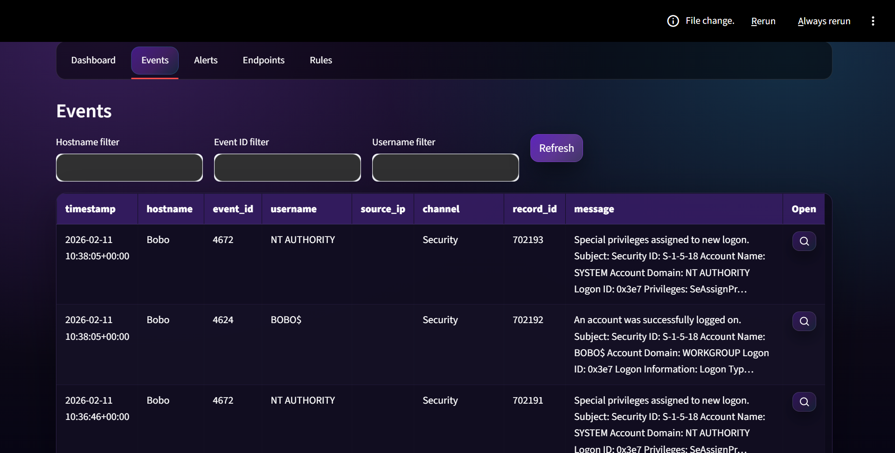
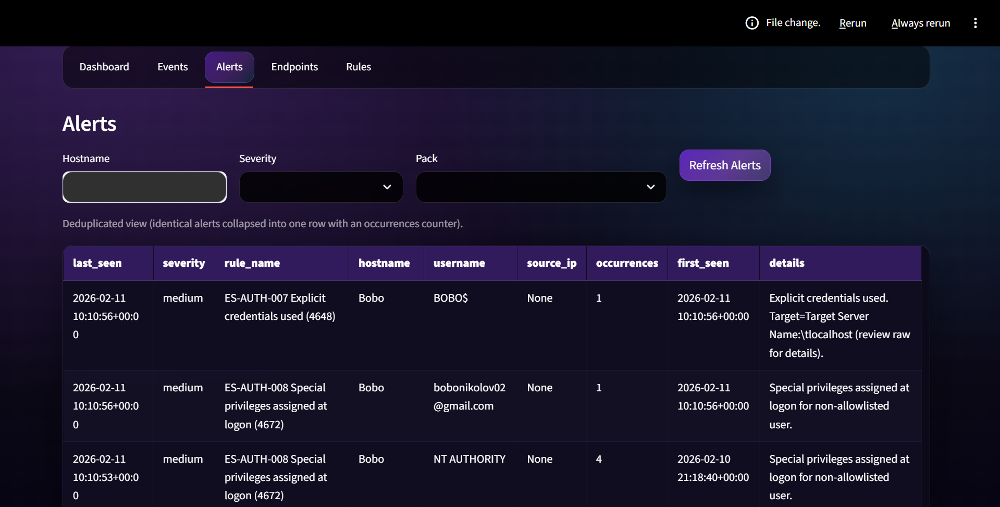
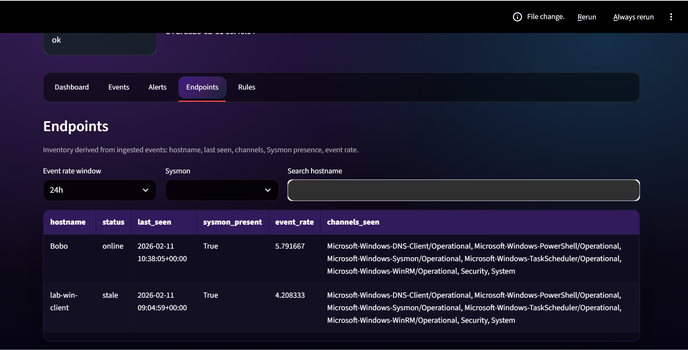
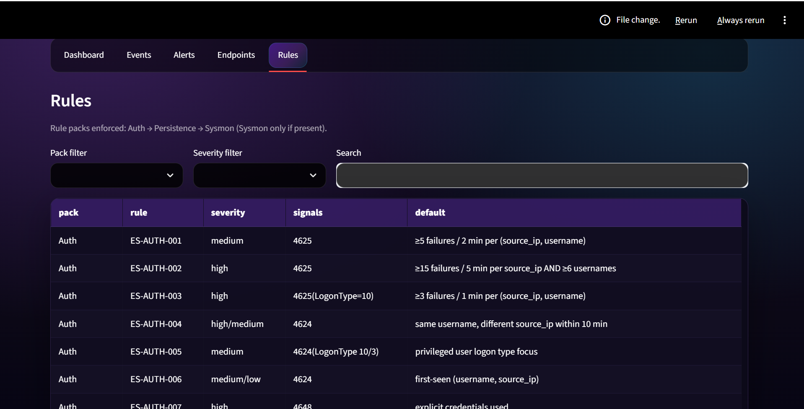

# EchoSentinel — EchoPentest Mini SIEM (Windows)

EchoSentinel is a lightweight, production-minded Windows detection stack from **EchoPentest**.  
A small endpoint agent collects high-value Windows telemetry, ships it to a FastAPI backend, and a Streamlit UI provides deterministic detections, alerts, and raw forensic evidence.

**Design principle:** collect → store → parse → detect → display

---

## What EchoSentinel is built for

EchoSentinel is intentionally scoped to support **real blue-team investigation paths**, not random lab noise.  
It is designed to back a structured portfolio and detection series covering:

1. SMB credential abuse (baseline)
2. RDP abuse and lateral movement
3. WinRM / PowerShell remoting
4. Persistence via scheduled tasks and services
5. Privilege escalation indicators
6. File share data exposure
7. DNS abuse and outbound behavior

---

## Architecture

### `sentinel_agent` (Windows endpoint collector)
- Reads multiple Windows event channels:
  - `Security`
  - `System`
  - `Microsoft-Windows-PowerShell/Operational`
  - `Windows PowerShell`
  - `Microsoft-Windows-WinRM/Operational`
  - `Microsoft-Windows-TaskScheduler/Operational`
  - `Microsoft-Windows-DNS-Client/Operational` (if enabled)
  - `Microsoft-Windows-Sysmon/Operational` (optional)
- Filters to a curated set of **high-signal event IDs**
- Sends normalized events to the backend over HTTP with an API key

### `backend` (FastAPI + SQLite)
- Stores raw events and alerts
- Runs deterministic rule packs in a fixed order:
  1. Authentication
  2. Persistence / Privilege
  3. Lateral movement
  4. Sysmon (only if present)
- Applies alert suppression to prevent noise
- Exposes catalog endpoints for supported channels and event IDs

### `ui` (Streamlit)
- Dashboard: event counts and alert summaries
- Events view: searchable table with raw-log drawer
- Alerts view: severity and pack filtering
- Rules catalog: transparency into detections and defaults

---

## Event coverage (by investigation domain)

EchoSentinel **collects events first**, then builds detections on top.  
The following event coverage supports all planned project series.

### Authentication, RDP, and session lifecycle
- `4624` — Successful logon
- `4625` — Failed logon
- `4634` / `4647` — Logoff events
- `4648` — Explicit credentials used
- `4672` — Special privileges assigned
- `4778` — RDP session reconnected
- `4779` — RDP session disconnected

**Used for:**  
RDP brute force, credential reuse, admin session analysis, unusual source hosts.

---

### Kerberos and NTLM (domain environments)
- `4768` — Kerberos TGT requested
- `4769` — Kerberos service ticket
- `4771` — Kerberos pre-authentication failed
- `4776` — NTLM authentication attempt

**Used for:**  
Password spray detection, lateral movement, legacy auth abuse.

---

### Account lifecycle and privilege escalation
- `4720` — User created
- `4722` — User enabled
- `4728` / `4729` — Added/removed from global groups
- `4732` / `4733` — Added/removed from local groups
- `4738` — User account changed
- `4740` — Account locked out

**Used for:**  
Local privilege escalation, persistence, insider-threat scenarios.

---

### Security posture tampering
- `1102` — Security log cleared
- `4719` — Audit policy changed

**Used for:**  
Anti-forensics and post-compromise cleanup detection.

---

### SMB and file share access
- `5140` — Network share accessed
- `5145` — Detailed file share access (if auditing enabled)

**Used for:**  
Data exposure, insider access, lateral discovery and exfiltration analysis.

---

### Scheduled tasks (persistence)
- `4698` — Scheduled task created
- TaskScheduler Operational:
  - `106` — Task registered
  - `140` — Task updated
  - `141` — Task deleted
  - `200` / `201` — Task execution start/stop

**Used for:**  
Persistence detection, IR validation, abnormal task behavior analysis.

---

### Windows services (lateral movement & persistence)
- `4697` — Service installed (Security)
- `7036` — Service state changed
- `7040` — Service start type changed
- `7045` — Service installed (System)

**Used for:**  
Remote service creation, malicious binaries, unauthorized service persistence.

---

### PowerShell and WinRM (remote execution)
- PowerShell Operational:
  - `4103` — Module logging
  - `4104` — Script block logging
- Windows PowerShell:
  - `400`, `403`, `600`, `800`
- WinRM Operational:
  - Multiple operational events (collected broadly)

**Used for:**  
WinRM lateral movement, script-based execution, admin tooling abuse.

---

### DNS and outbound behavior
- Sysmon `22` — DNS query (preferred)
- DNS Client Operational (if enabled)

**Used for:**  
Beaconing, suspicious domain resolution, C2-like patterns.

---

### Sysmon (optional but recommended)
- `1` — Process creation
- `3` — Network connection
- `7` — Image loaded
- `10` — Process access
- `11` — File creation
- `13` — Registry value set
- `22` — DNS query

**Used for:**  
Execution chains, LOLBins, persistence paths, advanced IR context.

---

## Why this event set matters

- Covers **real enterprise attack paths**
- Maps cleanly to SOC workflows and investigation playbooks
- Supports detection engineering, remediation, and validation pentests
- Avoids low-value noise while remaining extensible

EchoSentinel is not a “log everything” SIEM.  
It is a **purpose-built detection and investigation platform**.

---

## Data model (stored)

### Event
- `timestamp` (UTC)
- `hostname`
- `event_id`
- `username`
- `source_ip`
- `channel`
- `record_id`
- `raw` (full message)

### Alert
- `timestamp` (UTC)
- `severity` (low / medium / high)
- `rule_name`
- `hostname`
- `event_id`
- `username`
- `source_ip`
- `details`

---

# UI Walkthrough

## Front Page — System Status Overview

The landing view confirms operational state:

- Backend connectivity status  
- OS context (Windows)  
- Active storage engine (SQLite)  
- Feature modules enabled (Auth, Persistence, Sysmon)  

This verifies that the detection pipeline is functioning end-to-end.

---

## Dashboard — Operational Telemetry Summary

The dashboard provides:

- Event counts (last 24h) grouped by `event_id`
- Alert severity distribution (last 24h)
- Latest alert feed with rule mapping
- Direct visibility into high-volume authentication activity (4624 / 4672, etc.)

This supports rapid triage and baseline validation.

---

## Events View — Raw Forensic Evidence

The Events tab provides:

- Filter by hostname
- Filter by event ID
- Filter by username
- Channel visibility
- Record ID reference
- Raw message inspection drawer

This enables investigation workflows comparable to traditional SIEM event search interfaces.

---

## Alerts View — Deterministic Detections

The Alerts view shows:

- Severity classification
- Rule identifier (e.g., ES-AUTH-008)
- Host and username context
- Source IP attribution
- Deduplicated alert occurrences
- First seen / last seen timestamps

Alerts are generated strictly by deterministic rule packs.

---

## Endpoints — Host Inventory & Telemetry Health

The Endpoints tab displays:

- Hostname
- Status (online / stale)
- Last seen timestamp
- Sysmon presence detection
- Event rate (events per minute window)
- Channels observed

This provides lightweight endpoint health validation without deploying a heavyweight EDR.

---

## Rules Catalog — Detection Transparency

The Rules tab documents:

- Rule pack (Auth / Persistence / Sysmon)
- Rule ID
- Severity level
- Signal event IDs
- Default detection thresholds

This ensures detection transparency and supports detection engineering validation exercises.

---

## Operational Context

The screenshots demonstrate:

- Active authentication telemetry (4624, 4672)
- Privilege assignment detections
- Explicit credential usage alerts (4648)
- RDP and session-based detection support
- Deterministic rule firing within 24-hour aggregation windows

EchoSentinel operates as a controlled, explainable mini-SIEM designed for real blue-team workflows.

---

## How this fits the EchoPentest portfolio

EchoSentinel underpins:
- Default Wazuh-style detection
- Manual remediation exercises
- Wazuh engineering comparisons
- Validation pentests that prove detections actually fire

The progression mirrors a real blue-team learning path, not isolated labs.

---

## Branding

EchoSentinel is part of the **EchoPentest** ecosystem:  

focused security tooling built for operators, deterministic detections, and defensible evidence.
